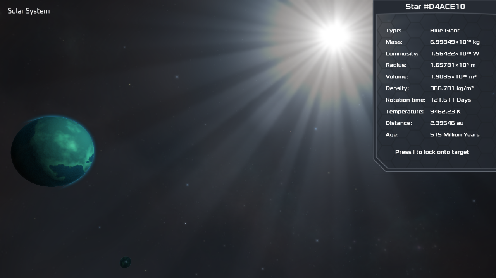

# Cosmic Void

Cosmic Void is an experimental procedural universe engine which uses OpenCL to quickly generate the universe as the camera moves and OpenGL to render things like star sprites. OpenGL and OpenCL can share memory on the GPU which means you can avoid sending data to system memory and solve problems in interesting ways. OpenCL is used to draw distant stars which cover less than a pixel and OpenCL is also used to render planets using ray-tracing on analytical spheres (the fastest ray intersection test). There are still a few bugs and many things which need to be finished but you can already explore a virtually endless universe full of stars.



## DEFAULT CONTROLS:

Control settings can be changed in the settings.cfg file. Scroll lock will enable/disable mouse control. Click a star, planet, or moon to select it and L to lock onto it. Once locked on you can press P to move towards it with auto-pilot. WASD for movement, up and down keys for vertical movement, page up to increase speed, page down to decrease speed. You'll need to decrease a lot to enter a solar system, and planets will be a bit hard to find even though they are unrealistically enlarged. Planet sizes and other settings can be changed by editing Resource.h and the variables.cl kernel.

## DEPENDENCIES:

- [SoLoud](https://github.com/jarikomppa/soloud)
- [Freetype GL](https://github.com/rougier/freetype-gl)
- [SOIL2](https://github.com/SpartanJ/SOIL2)
- [GLFW3](https://www.glfw.org/)
- [GLM](https://github.com/g-truc/glm)
- [OpenCL SDK](https://github.com/KhronosGroup/OpenCL-SDK)
- GLEW

## COMPILING:

Ideally you should try to build Cosmic Void in Code::Blocks with gcc by using the included project file (replace `C:\cb_projects\CosmicVoid\` with your project path). Cosmic Void was developed on Windows using the mingw64 gcc compiler but I tried to keep the code portable so any problems should be easy to fix.

### Windows:

Install [MSYS2](https://www.msys2.org/) and run this command in the shell to get started:

```
pacman -S mingw-w64-ucrt-x86_64-gcc mingw-w64-ucrt-x86_64-make mingw-w64-ucrt-x86_64-glew mingw-w64-ucrt-x86_64-glfw mingw-w64-ucrt-x86_64-glm mingw-w64-ucrt-x86_64-brotli
```

Some dependencies will need to be compiled as static libraries using the -static compiler flag or an available option.

Usually you can create a makefile with cmake and then use the `mingw32-make` command to compile the required libraries.

When using cmake to configure a build, make sure any required library paths link to the static library files (not .dll.a files).

When configuring Freetype GL the WITH_GLEW and USE_VAO options should be enabled and GLEW_STATIC should be defined.
 
The cmake files for SoLoud can be found in the contrib folder, ensure the SOLOUD_BACKEND_WINMM option is enabled.

HarfBuzz requires the freetype, glib, and graphite2 dependencies, also ensure GRAPHITE2_STATIC and GLIB_STATIC_COMPILATION are defined.

The OpenCL SDK doesn't seem to provide static library files so you might also need to compile it using the -static flag.

## NOTE:

The fonts and audio files are not included in the repository but can be obtained by downloading the Windows release.
